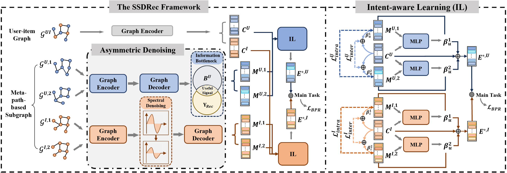

# SSDRec: Spectral Denoising for Noisy Meta-Path Graphs in Heterogeneous Recommendation
Qiufen Ni, Yuxin Zheng, Jianxiong Guo*, Jiandian Zeng, Tian Wang and Weili Wu. 

## Model Architecture


## Enviroments
- python==3.10
- pytorch==2.0
- cuda==118
- dgl==2.0
## How to Run the code
```
python main.py --dataset=douban-movie --device='cuda:0'
```
## Citation


